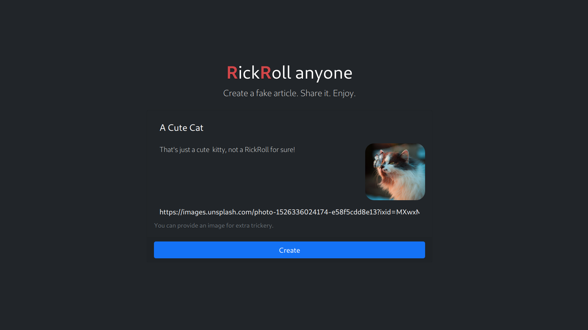
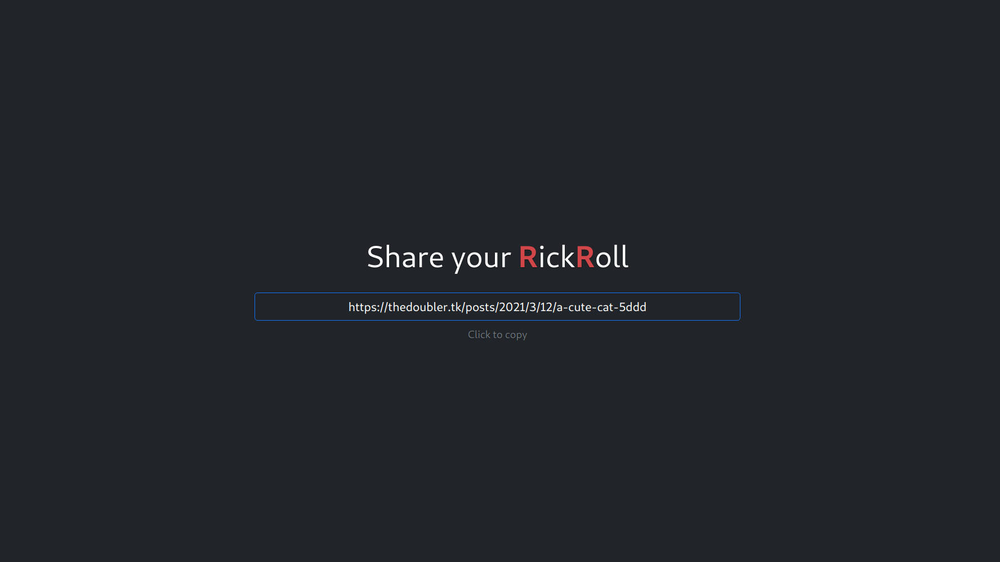
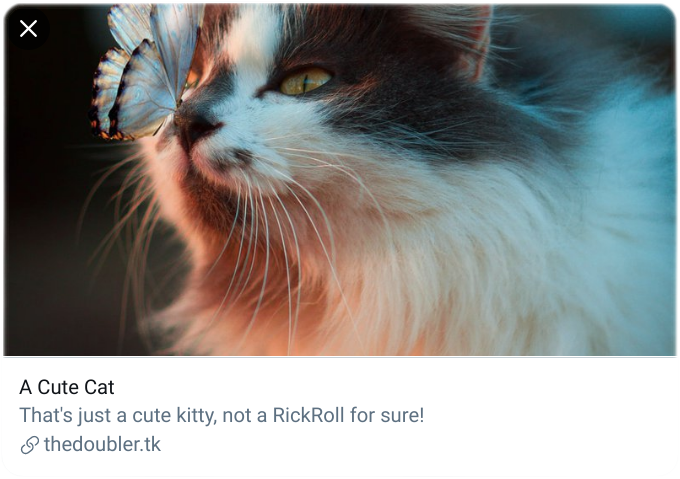

<br />
<p align="center">
  <a href="https://thedoubler.tk">
    
  </a>

  <h3 align="center">TheDoubleR</h3>

  <p align="center">
    RickRoll like there's no tomorrow.
    <br>
    Conceal your RickRolls with a credible fake article. Complete with title, description and an image.
    <br>
    <a href="https://thedoubler.tk"><strong>Try it out »</strong></a>
    <br>
    <br>
    <a href="https://thedoubler.tk">View Site</a>
    ·
    <a href="https://github.com/thatsed/TheDoubleR/issues">Report Bug</a>
    ·
    <a href="https://github.com/thatsed/TheDoubleR/issues">Request Feature</a>
  </p>
</p>

<!-- TABLE OF CONTENTS -->
<details open="open">
  <summary>Table of Contents</summary>
  <ol>
    <li>
      <a href="#about-the-project">About The Project</a>
      <ul>
        <li><a href="#platforms-supported">Platforms Supported</a></li>
        <li><a href="#rationale">Rationale</a></li>
      </ul>
    </li>
    <li>
      <a href="#deploy-your-own">Deploy your Own</a>
      <ul>
        <li><a href="#requisites">Requisites</a></li>
        <li><a href="#installation">Installation</a></li>
        <li><a href="#deployment">Deployment</a></li>
      </ul>
    </li>
    <li><a href="#contributing">Contributing</a></li>
    <li><a href="#license">License</a></li>
  </ol>
</details>

## About the Project

**Create a fake article**



**Share it**



**Enjoy**


<p align="center">Twitter Preview. Whomever falls to the cuteness of the kitten would get rickrolled.</p>

### Platforms Supported

Currently headers sent by the following applications are being parsed as bots:
- WhatsApp
- Telegram
- Twitter
- Discord
- Reddit

It may be that other platforms are already supported. You may ask support for another platform by 
[opening an issue](https://github.com/thatsed/TheDoubleR/issues). 

### Rationale

> Why?

I saw a video on _a popular video sharing platform_ of a guy asking Guinness World Records recognition for the most 
celebrities **RickRolled** in a week. I saw him sharing the links using _a popular link-shortener website_, 
and I was shocked by how primal his technique was.

So here we are now!

### Built with

Application:
- [Django](https://www.djangoproject.com/)
- [Bootstrap](https://getbootstrap.com/)
- [Vanilla JS](http://vanilla-js.com/)

Deployment:
- [Docker](https://www.docker.com/)
- [PostgreSQL](https://www.postgresql.org/)
- [NGINX](https://www.nginx.com/)

## Deploy your own

You know, once people start to recognize the domain it won't fool 'em anymore.

So you may as well just get another one up!

### Requisites

To deploy your own rickrolling factory, you will need:
- some server of some kind (it's pretty light, so no need to overdo it)
- `docker` and `docker-compose` installed on it
- an email address (used to issue a free Let's Encrypt SSL certificate)
- a domain (you may find some free ones around the web, go for them)

### Installation

Clone the repo and `cd` into the `.deployment` folder:
```
$ git clone git@github.com:thatsed/TheDoubleR.git
$ cd TheDoubleR/.deployment
```

Generate some secrets using the `deploy.sh` utility (replace your own domain and email address):
```
$ ./deploy.sh example.org your-email@domain.com
``` 

This will generate a `.env` file containing some newly generated secrets.

You may adjust the `docker-compose.yml` to your needs.
You can also deploy a `sqlite3` version using the other compose file 
to ease the resources requirements.

### Deployment

(Remember to `cd .deployment`)

Either `source` the env file or the source script before running `docker-compose` commands:
```
$ source deploy.sh
```
or
```
$ source .env
```

Then build and launch with Docker:
```
$ docker-compose up -d --build
```

You should now reach it at the domain you specified earlier.

## Contributing

Feel free to contribute to the project!

Easiest way to contribute is by adding support to more platforms' previews.
We need to identify which `User-Agent` the platforms' bots' requests use, as well as how to make the 
preview look pretty by providing good `meta` tags.

Fork the project or open an issue to get started!

## License

It's [MIT](LICENSE), do whatever.

## Share

Share the word, rickroll the world. Be kind to one another. Have a good one.

